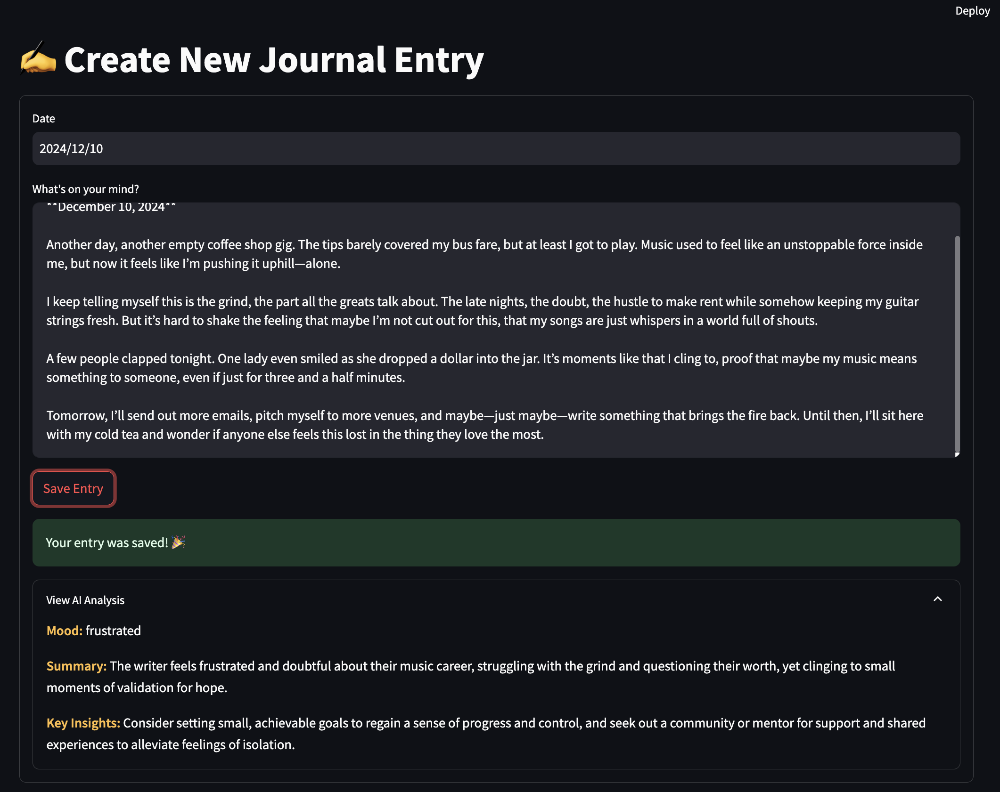
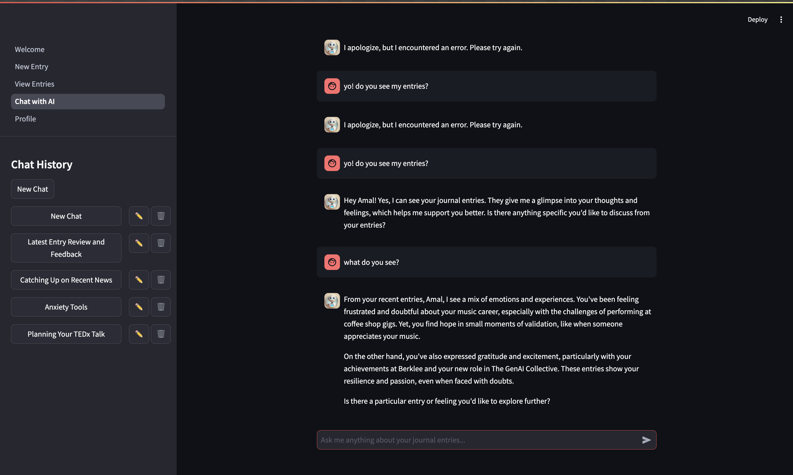

# Check-in: Your AI-Powered Digital Journal
YOO! 👋 

Welcome to <span style="color: #FFA500">**Check-in**</span>, a digital journaling app that combines the therapeutic power of writing with AI-driven insights!

## What's This All About?
The application is intended really just for personal use. I have started journaling a couple years ago, and always wanted a way to chat with myself, my thoughts, look back at the specific insights, patters, and this application does exactly that. 

## Main Features

- **Smart Journaling**: Write entries and get AI-powered analysis of your mood and key insights
- **Chat with Levi**: Your personal AI companion who understands your journal history and provides ingishts on specific patterns in your mood/events
- **Entry Management**: Search, filter, and organize your thoughts in a cool old school looking streamlit UI
- **Profile Analytics**: Track your journaling journey with placeholder stats lol (placehpolder for now, will update hahah)


## 📝 Frontend
For the frontend I am using <a href="https://streamlit.io">streamlit</a>. Really can't go wrong with tihs one for rapid UI development + I wanted to practice more python 🐍 + integrating next js would be a pain in the butt for the 3 weeks that we had for this project.

So, I have started with prototyping the project tree first trying to understand high level how it would look like. We have the **Welcome page** that greets the user and directs to sign in/sign up if the account is not created yet. (I will rage about auth later, difenelty pissed at the complexity of setting up auth)

Next we have the main pages of the app:
- **New Entry -** a page for a user to add their entry and get AI Analysis of their entry: key insights, mood etc.
- **View Entry** - a page integrated with a database (supabase) to fetch journal entries, filter by specific keywords or dates. 
- **Chat with Levi** - Levi is your personal assistant - a friend you can rely on for some good conversation. This is a GPT like chatbot window where you can chat about your entires, monitor cat windows and create/edit new ones.
- **Profile** - Wanna change your name for some reason? You can do that here. A bonus that Levi will be updated as well and will call you by your new updated name. Also, added some fun stats like how many entries you have, how many days you are active on the platform etc.


Aaand we have the big guys, auth and utils.  

**auth.py** is  authentication manager 🔑

It handles all the login/signup stuff for the app.

and **utils.py** for some helper tools that makes sure that every request includes auth token,and gives new token if the old one expires etc. It also makes sure that we are properly connected to the api services on the backend.

### Styling 
Thanks to the [Streamlit blog post on app design](https://blog.streamlit.io/designing-streamlit-apps-for-the-user-part-ii/), I was able to create a clean and intuitive interface that makes journaling easy and enjoyable (hopefully).


Learned you can actually inject custom CSS:
```python
st.markdown("""
    <style>
    .chat-message {
        padding: 1rem;
        border-radius: 0.5rem;
        margin: 1rem 0;
        background: #f0f2f6;
    }
    </style>
""", unsafe_allow_html=True)
```

### State Management
The trickiest part was managing user sessions. Had to use Streamlit's session state creatively:
```python
# Check if user is authenticated
if 'auth_token' not in st.session_state:
    st.warning("Please log in first!")
    st.stop()
```

## Pain Points

1. Streamlit's not really built for complex auth, so I had to get creative with session management.

2. Found out Streamlit reruns the entire script on updates. Had to be really careful with state management.

3. Numbered the files (1_, 2_, etc.) to force the right sidebar order - bit hacky but works!

### What Surprised Me

1. Didn't expect built-in stuff like `st.expander` to be so useful
2. The performance is actually pretty good
3. Markdown support made text formatting super easy


## 🧠 Backend
I love buidling backend. I think frontend is for those who failed at building scalabale backend. Did I say that I love backend? Yeah, so I love backend, since all the logic and the meat of the app is happening here. 

I started with outlining the **key features** of the app: 
1. **Smart Journaling**
- Create new journal entries with date selection
- Real-time AI analysis of entries providing:
  - Mood detection
  - Entry summary
  - Key insights
  - Content categorization


2. **Entry Management**
- View all journal entries in chronological order
- Filter entries by date range
- Search entries by keywords
- Delete entries with confirmation
- Expandable entry view with AI analysis


3. **Chat with AI (Levi)**
- Personal AI assistant with context awareness
- Multiple chat windows support
- Real-time streaming responses
- Chat history management (create, rename, delete)
- Custom AI avatar for personality


4. **User Profile & Analytics**
- Personal profile management
- Usage statistics:
  - Total entries count
  - Days active
  - Average entries per week
  - Member since date tracking
  - Recent activity log

And of course...

5. **Authentication**
- Secure login/signups
- Token-based authentication
- Automatic session refresh
- Integration with [Supabase](https://supabase.com/) for authentication and data storage
---

Now, in order to build all of that, I also needed an understanding of a api routing. I started with FastAPI integration and [main.py](backend/main.py) which handles all the core API endpoints and middleware.

I chose FAST API as a central API handler for its simplicity and usablility. I have used it a couple of times before + the routing features are bliss. 


## Core Architecture
I went with FastAPI because Django felt too heavy and Flask too basic. FastAPI hits that sweet spot - it's fast (duh), has great docs, and the async stuff just works. Plus, the automatic API docs are **chef's kiss**.


Here's the basic structure I landed on after a lot of refactoring (trust me, you don't want to see version 1):

```python
app = FastAPI()

# Had to add this to make frontend work
app.add_middleware(
    CORSMiddleware,
    allow_origins=["http://localhost:3000"],
    allow_credentials=True,
    allow_methods=["*"],
    allow_headers=["*"],
)
```

## Main Features

### 1. Journal Stuff
This was actually easier than I thought. The basic flow is:
- User writes entry
- Backend saves it
- AI analyzes it
- Everything gets stored in Supabase

Here's how the analysis endpoint works:
```python
@app.post("/analyze-entry")
async def analyze_entry(entry: JournalEntryRequest):
    return await JournalService.analyze_entry(entry.content)
```

Looks simple right? The real magic happens in the services.

### 2. Chat System (The Hard Part)

Not gonna lie, this part gave me headaches. Getting real-time streaming to work with OpenAI was... interesting. I looked throigh all the open ai api docs and I finally cracked it:

```python
async def get_chat_response(user_id: str, message: str, window_id: str):
    try:
        # Get chat history
        conversation_history = await ChatService.get_chat_history(user_id, window_id)
        
        # This streams the response back to the user
        response = client.chat.completions.create(
            model="gpt-4o",
            messages=messages,
            stream=True
        )
        
        for chunk in response:
            if chunk.choices[0].delta.content:
                yield chunk.choices[0].delta.content
                
    except Exception as e:
        logging.error(f"Ugh, something broke: {str(e)}")
        yield "Sorry, I messed up. Try again?"
```
I am getting a previous chat history for context, and instead of waiting for the complete response, I stream it by chunks, piece by piece so it shows the response gradually.


## How Levi (The AI) Actually Works With Your Journals

### The Context Magic
Let me show you how I got the AI to actually understand context from journals. The real implementation is pretty interesting:

```python
async def get_chat_response(user_id: str, message: str, window_id: str):
    try:
        # Get chat history for context
        conversation_history = await ChatService.get_chat_history(user_id, window_id)
        
        # Save user message and generate title if first message
        await ChatService.save_message(user_id, window_id, "user", message)
        if not conversation_history:
            await ChatService.generate_and_update_title(user_id, window_id, message)

        # Get user info for personalization
        supabase = get_client()
        user = supabase.auth.get_user()
        user_name = user.user.user_metadata.get('full_name', 'friend')
        
        # Get stats for context
        entries = await DatabaseService.get_user_entries(user_id)
        total_entries = len(entries.data) if entries.data else 0
        
        # Get user's first entry date
        first_entry = supabase.table("journal_entries")\
            .select("created_at")\
            .eq('user_id', user_id)\
            .order('created_at')\
            .limit(1)\
            .execute()
        member_since = first_entry.data[0]['created_at'] if first_entry.data else user.user.created_at

        # Get recent entries for context
        entries_result = DatabaseService.get_recent_entries(user_id, limit=5)
        entries_context = "\n".join([
            f"Entry Date: {entry.get('created_at', '')}\n"
            f"Content: {entry.get('entry', '')}\n"
            f"Analysis: Mood: {entry.get('journal_analyses', [{}])[0].get('mood', 'N/A')}, "
            f"Summary: {entry.get('journal_analyses', [{}])[0].get('summary', 'N/A')}, "
            f"Key Insights: {entry.get('journal_analyses', [{}])[0].get('key_insights', 'N/A')}\n"
            for entry in (entries_result.data or [])
        ])

        # Build the complete context for Levi
        system_prompt = f"""You are Levi, a friendly and empathetic AI companion. Your current conversation is with {user_name}. 
        Help {user_name} process their thoughts and feelings by referencing their journal entries, profile data, and previous analyses."""

        context_prompt = f"""User's Profile and Context:
        Name: {user_name}
        Statistics:
        - Total Journal Entries: {total_entries}
        - Member Since: {member_since}

        Recent Journal Entries:
        {entries_context}"""

        # Prepare the complete message history
        messages = [
            {"role": "system", "content": f"{system_prompt}\n\n{context_prompt}"},
            {"role": "system", "name": "system", "content": f"Remember: You are talking to {user_name}"}
        ]

        # Add recent conversation history
        if conversation_history:
            for msg in conversation_history[-10:]:  # Last 10 messages
                if msg["role"] == "user":
                    msg["name"] = user_name
                messages.append(msg)

        # Add current message
        messages.append({"role": "user", "name": user_name, "content": message})

        # Get streaming response
        response = client.chat.completions.create(
            model="gpt-4o",
            temperature=0.2,
            messages=messages,
            stream=True
        )

        # Stream and save response
        full_response = ""
        for chunk in response:
            if chunk.choices[0].delta.content:
                content = chunk.choices[0].delta.content
                full_response += content
                yield content
        
        await ChatService.save_message(user_id, window_id, "assistant", full_response)

    except Exception as e:
        logging.error(f"Chat error: {str(e)}")
        yield "I apologize, but I encountered an error. Please try again."
```
The really interesting part about how Levi works is its comprehensive understanding of context. Instead of just seeing the current message, Levi maintains a complete picture of who it's talking to. It pulls in the user's full name, keeps track of their journaling history (including total number of entries), and even knows how long they've been using the platform. 

When someone chats with Levi, it has access to their recent journal entries along with all the AI analyses it has done on them - moods, insights, everything. This helps Levi maintain really personalized conversations.

The history management system is another aspect I'm pretty happy with. The system intelligently maintains the last 10 messages of any conversation for context, but it goes beyond just storing them. When someone starts a new chat, Levi automatically generates a relevant title based on the conversation's content, and every response gets saved for future reference. This means conversations can pick up where they left off, with Levi remembering previous discussions.


### AI Analysis Implementation

The AI stuff uses OpenAI's API. Here's how it works under the hood:

```python
# AI ANALYSIS
def analyze_journal_entry(text: str) -> Dict:
    """
    Analyzes a journal entry using OpenAI's GPT model acting as an expert psychologist to extract 
    meaningful psychological insights and patterns. Returns a structured analysis focusing on emotional 
    state, key themes, and actionable insights for personal growth.
    """
    prompt = """As an expert psychologist, analyze this journal entry with empathy and psychological insight. 
Provide a structured analysis in the following format:

1. mood: Identify the primary emotional state (select exactly one):
   - joyful (feeling happy and cheerful)
   - content (satisfied and at peace)
   - neutral (neither positive nor negative)
   - anxious (worried or uneasy)
   - sad (unhappy or down)
   - angry (feeling strong displeasure)
   - frustrated (annoyed or discouraged)
   - excited (enthusiastic and eager)
   - grateful (appreciative and thankful)
   - overwhelmed (feeling excessive pressure)

2. summary: Write one clear, empathetic sentence that captures both the main experience/thought 
   and its emotional impact on the writer

3. categories: Identify the key life domains discussed (select all that apply):
   - health (physical and mental well-being)
   - career (work and professional development)
   - relationships (social connections and interactions)
   - personal_growth (learning and self-development)
   - daily_life (routine activities and general experiences)

4. key_insights: Provide one psychologically-informed, actionable insight that the writer can 
   use for self-reflection or positive change

Format your response as a JSON object with keys: 'mood', 'summary', 'categories', and 'key_insights'.
Focus on providing clear, empathetic, and professionally-grounded psychological insights."""

    try:
        response = client.chat.completions.create(
            model="gpt-4o",
            temperature=0.1,
            messages=[
                {"role": "system", "content": "You are an expert journal analyst focused on extracting clear, actionable insights. Respond with clean JSON only."},
                {"role": "user", "content": f"{prompt}\n\nJournal entry:\n{text}"}
            ]
        )

        response_text = response.choices[0].message.content.strip()
        response_text = response_text.replace('```json', '').replace('```', '')
        
        analysis = json.loads(response_text)
        
        # check all fields are present
        required_fields = ['mood', 'summary', 'categories', 'key_insights']
        if not all(field in analysis for field in required_fields):
            raise ValueError("Response missing required fields")
            
        return analysis
```

The response looks like this:
```json
{
    "mood": "anxious",
    "summary": "User is stressed about upcoming project deadlines",
    "categories": ["career", "personal_growth"],
    "key_insights": "Consider breaking large tasks into smaller chunks"
}
```


I set the temperature to 0.1 to keep responses consistent (lower temp = more focused outputs). I REALLY WANTED to implement OpenAI's structured outputs feature (https://openai.com/index/introducing-structured-outputs-in-the-api/) to ensure the responses are always valid JSON with the exact schema we need, but since the use case is pretty straightformard, decided to stay with more a general prompt.

## 3. Database

Used Supabase for this because it is open source and I love the simplicity and their docs. Plus firebase is boring.

- journal_entries: Stores the actual journal entries
- journal_analyses: Keeps the AI analysis stuff
- chat_windows: Manages different chat sessions
- chat_history: All the messages

### Auth (kinda worked)

Had to split this between a few files to keep things organized.

In `auth.py`, I created an AuthService class that handles the basic auth operations:

```python
class AuthService:
    @staticmethod
    async def sign_up(email: str, password: str):
        try:
            return supabase.auth.sign_up({
                "email": email,
                "password": password
            })
        except Exception as e:
            raise Exception(f"Error during sign up: {str(e)}")

    @staticmethod
    async def sign_in(email: str, password: str):
        try:
            return supabase.auth.sign_in_with_password({
                "email": email,
                "password": password
            })
        except Exception as e:
            raise Exception(f"Error during sign in: {str(e)}")

    @staticmethod
    async def get_user(access_token: str):
        try:
            response = supabase.auth.get_user(access_token)
            if not response or not response.user:
                raise Exception("No user found")
            return response
        except Exception as e:
            logging.error(f"Error in get_user: {str(e)}")
            raise Exception(f"Error getting user: {str(e)}")
```

## Extended Auth Service

In `auth_service.py`, I added some extra functionality for validating users and handling tokens:

```python
class AuthService:
    @staticmethod
    async def validate_user(request: Request) -> str:
        auth_header = request.headers.get("Authorization")
        if not auth_header or not auth_header.startswith("Bearer "):
            raise HTTPException(status_code=401, detail="Missing or invalid authorization header")
        
        try:
            token = auth_header.split(" ")[1]
            user = get_client().auth.get_user(token).user
            if not user:
                raise HTTPException(status_code=401, detail="Invalid or expired token")
            return user.id
        except Exception as e:
            logging.error(f"User validation failed: {str(e)}")
            raise HTTPException(status_code=401, detail="Authentication failed")
```

## Database Integration

The auth system ties directly into these Supabase tables (models.py):
- journal_entries
- chat_message
- journal_analysis

Each table has user_id fields that link back to Supabase's auth system.

### API Endpoints

Here are the main ones that do the heavy lifting in main.py:

#### Journal Routes
- POST /journal-entry -> Creates and analyzes new journal entries
- GET /entries -> Gets all entries with optional search, start_date and end_date filters
- DELETE /entries/{entry_id} -> Deletes a specific journal entry
- POST /analyze-entry -> Analyzes entry without saving it

#### Chat Routes  
- POST /chat -> Streams chat responses
- POST /chat/window/create -> Creates new chat window
- GET /chat/windows -> Lists all chat windows for user
- GET /chat/history/{window_id} -> Gets chat history for a window
- DELETE /chat/window/{window_id} -> Deletes a chat window
- PUT /chat/window/{window_id}/rename -> Renames a chat window


## 🗺️ The Journey (aka What I Actually Learned)

You know what's funny? When we first talked about this project, I thought "cool, I'll make a simple journaling app with some AI sprinkled in." Man, was wrong... Started with FastAPI because I'm comfortable with Python, but then went down this rabbit hole of async programming and streaming responses that had me questioning my life choices at 3 AM. The real game-changer was figuring out how to make Levi (the AI) actually understand context - like, it's not just spitting out generic responses, it's actually reading through your past journals and picking up on patterns. ( and remember I wanted to add audio and video capability? Not happenning... for now. I would love to add it later though)

The auth stuff nearly broke me though - every time I thought I fixed something, three new issues popped up. Seriously, I must have rewritten the token refresh logic like five times. And don't even get me started on that database error during signup that's still there (sorry about that). 

Working with openai was probably the most interesting part. Took me forever to get the prompts right - turns out you really need to be specific with AI. At first, Levi was giving these vague, fortune-cookie responses, but after tweaking the prompts and adding all that context about past entries and moods, it started feeling more like chatting with someone who actually knows you. And even though there are still some bugs (okay, quite a few bugs), I'm actually using this app myself now. There's something satisfying about building something that actually solves a problem you have.


---

# UPDATE ON THE CLASS DEMO!

the ai functionlaity did not work since my API key was exposed. All fixed now!





